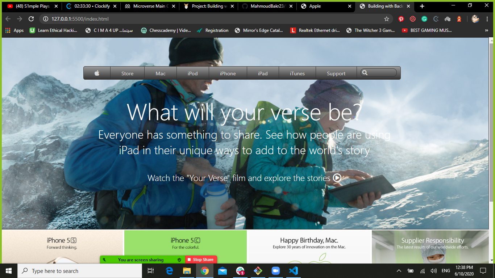

# Building-with-Backgrounds-and-Gradients
Building with Backgrounds and Gradients

**This is a webpage which is similar to old Apple's page.**

## Built With

- HTML
- CSS3

[Live Demo Link](https://rawcdn.githack.com/MahmoudBakr23/Building-with-Backgrounds-and-Gradients/beba9eb9aa6e72c2ec6fc8867b34958b316e1807/index.html)

## Getting Started

**Clone this Github repository.**

## Authors

👤 **Author1**

- Github: [@MahmoudBakr23](https://github.com/MahmoudBakr23)
- LinkedIn: [Mahmoud Bakr](https://www.linkedin.com/in/mahmoud-bakr-a76323194/)
- Gmail: mbakr6821@gmail.com

👤 **Author2**

- Github: [@OlawaleJoseph](https://github.com/OlawaleJoseph)